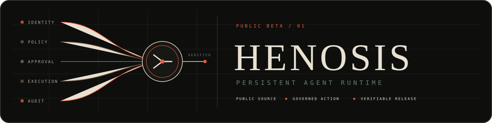

<p align="center">
  
</p>

# Henosis

Governed infrastructure for persistent AI agents.

[](https://github.com/Syntheos-Systems/henosis/actions/workflows/ci.yml)
[](https://github.com/Syntheos-Systems/henosis/releases)
[](LICENSE)
[](Cargo.toml)

[Releases](https://github.com/Syntheos-Systems/henosis/releases) · [Desktop source](apps/desktop/) · [Security](SECURITY.md) · [Limitations](scripts/known-incomplete.md) · [Contributing](CONTRIBUTING.md)

Henosis gives agents a durable place to work across sessions while operators retain control of identity, policy, approvals, credentials, execution, and audit. Rift rooms provide the human coordination surface. A headless Rust control plane owns the trust boundary.

> **Public alpha:** v0.1.0-alpha.6 contains headless archives. Desktop source and release packaging live in this source tree, but that tagged release has no desktop installers. Local mode binds to loopback and supports one operator. Review the [limitations ledger](scripts/known-incomplete.md) before any network exposure.

Henosis authenticates each request, checks current membership and policy, binds any approval to the exact action, limits execution, filters the result, and commits the audit record before returning control.

## Start here

### Headless runtime

The installers select the host platform, verify `SHA256SUMS`, install into the current user account, run `henosis init --quick`, and restore the prior version if initialization fails.

On Linux or macOS, copy and run this command:

```sh
curl --proto '=https' --tlsv1.2 --fail --silent --show-error --location \
  https://raw.githubusercontent.com/Syntheos-Systems/henosis/1a9ff0730f36e9a3af537e09177d36e3be204229/install.sh \
  | sh -s -- --version v0.1.0-alpha.6
```

On Windows, open PowerShell, copy this command, and press Enter:

```powershell
$installer = Join-Path ([IO.Path]::GetTempPath()) "henosis-install-$([guid]::NewGuid().ToString('N')).ps1"
try {
  irm 'https://raw.githubusercontent.com/Syntheos-Systems/henosis/1a9ff0730f36e9a3af537e09177d36e3be204229/install.ps1' -OutFile $installer
  $powerShell = (Get-Process -Id $PID).Path
  & $powerShell -NoProfile -ExecutionPolicy Bypass -File $installer -Version 'v0.1.0-alpha.6'
  if ($LASTEXITCODE -ne 0) { throw "Henosis installer exited with code $LASTEXITCODE" }
} finally {
  Remove-Item -LiteralPath $installer -Force -ErrorAction SilentlyContinue
}
```

Both commands pin the installer to a reviewed commit and select the release version as a separate input. Start the loopback service:

```sh
$HOME/.local/bin/henosis serve
```

On Windows:

```powershell
& "$HOME\.local\bin\henosis.exe" serve
```

Henosis is ready when `http://127.0.0.1:8088/health` returns `ok`. The first boot writes a private owner token under `HENOSIS_HOME`; live CLI commands read it from disk.

Create a scoped machine token for an agent or integration and capture its one-time credential:

```sh
export HENOSIS_AGENT_TOKEN="$($HOME/.local/bin/henosis token create first-agent --token-only)"
```

On Windows:

```powershell
$env:HENOSIS_AGENT_TOKEN = & "$HOME\.local\bin\henosis.exe" token create first-agent --token-only
```

The local compatibility authority recognizes `henosis.probe` in `!henosis-local:loopback`. Each dispatch needs an `X-Henosis-Idempotency-Key` scoped to the tenant and principal.

```sh
curl --fail-with-body http://127.0.0.1:8088/api/v1/dispatch \
  -H "Authorization: Bearer $HENOSIS_AGENT_TOKEN" \
  -H "Content-Type: application/json" \
  -H "X-Henosis-Idempotency-Key: first-agent-probe-1" \
  --data '{"tool":"henosis","action":"probe","args":{},"context":{"room":"!henosis-local:loopback"}}'
```

Repeating the same key and request returns the stored filtered result. Reusing the key with different content returns a conflict. An action that needs approval returns `202 Accepted`; approve its ID with `henosis approvals approve <approval-id>`, then repeat the request with the original key and `X-Henosis-Approval-Id`.

## Desktop

The Tauri application opens to the Rift room directory and pins the room with the newest activity. It keeps Rift tokens in the native process and stores sanitized connection and room-cache data. Build and development instructions live in [apps/desktop](apps/desktop/README.md).

## Trust model

| Boundary | Henosis behavior |
| --- | --- |
| Identity | Human and machine credentials are tenant-bound, scoped, revocable, and checked against live membership. |
| Approval | Durable, one-use approvals bind to the request, principal, tenant, policy revision, and expiry. Production requires a different administrator from the requester. |
| Execution | The Wasmtime Component Model host enforces fuel, memory, time, output, and network limits. Third-party extension loading remains disconnected in the alpha. |
| Filesystem | Built-in file tools accept task-root-relative paths and reject traversal and symlink escapes. `bash` is a separate capability with the operating-system access of the Henosis process. |
| Credentials | Tools request named broker operations without receiving raw secrets. Production uses the external `phylaxd` broker. |
| Audit | Henosis writes synchronous hash-chained records and supports an independent witness. Production requires off-host intent and outcome receipts. |

```text
operator or agent
        |
        v
identity -> policy -> approval -> bounded execution -> filtered result
                                      |
                                      v
                               audit and witness
```

Model providers sit behind a shared interface. Capability authorization stays on the server, so switching models does not move the trust boundary into a prompt or client application.

## Deployment boundary

| Mode | Contract |
| --- | --- |
| Local | Loopback-only, one operator, SQLite state, embedded compatibility policy, and restart-scoped quota counters. The signed compatibility room authorizes `henosis.probe` only. |
| Production | Managed PostgreSQL, TLS and authenticated ingress, protected storage, backups, source-aware login limits, an independent audit witness, and private `phylaxd` access. |

The full Pistis service is private and does not ship in this repository. Production capability requests fail closed until the deployment supplies trusted room state from Pistis. See [SECURITY.md](SECURITY.md), [`containers/production.env.example`](containers/production.env.example), and the [`containers/agents.production.example.toml`](containers/agents.production.example.toml) starter roster for the full contract.

Run local mode with Compose:

```sh
docker compose -f containers/compose.local.yml up --build
curl http://127.0.0.1:8088/health
```

Compose uses `henosis init --quick` and stores state in the `henosis-state` volume.

## Build from source

The headless workspace requires Rust 1.88 or newer:

```sh
cargo build --locked --workspace
cargo test --locked --workspace
```

The desktop application uses pnpm 11 and an isolated Tauri Cargo workspace:

```sh
cd apps/desktop
pnpm install --frozen-lockfile
pnpm test
pnpm build
```

## Verify a release

Each release includes checksums, SPDX SBOMs, and GitHub OIDC provenance. Verify the Linux x86-64 archive after downloading it with `SHA256SUMS`:

```sh
grep -F '  henosis-0.1.0-alpha.6-x86_64-unknown-linux-musl.tar.gz' SHA256SUMS \
  | sha256sum --check

gh attestation verify henosis-0.1.0-alpha.6-x86_64-unknown-linux-musl.tar.gz \
  --repo Syntheos-Systems/henosis \
  --signer-workflow Syntheos-Systems/henosis/.github/workflows/ci.yml
```

## Repository map

| Path | Contents |
| --- | --- |
| [`crates/`](crates/) | Rust services for the runtime, identity, approval, audit, Rift, memory, model providers, and tools. |
| [`apps/desktop/`](apps/desktop/) | The React and Tauri desktop application. |
| [`containers/`](containers/) | Local and production Compose contracts. |
| [`scripts/`](scripts/) | Release validation, dependency checks, and the public limitations ledger. |

## Security and support

Send vulnerability reports to [security@syntheos.dev](mailto:security@syntheos.dev). Send non-sensitive support requests to [support@syntheos.dev](mailto:support@syntheos.dev). Do not put credentials, private endpoints, or exploit details in a public issue.

## License

Henosis source is available under the [Elastic License 2.0](LICENSE). The license does not permit offering Henosis to third parties as a hosted or managed service. Contact [support@syntheos.dev](mailto:support@syntheos.dev) for commercial terms.
